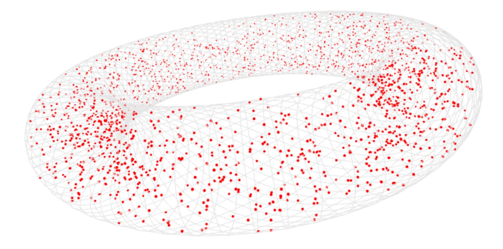

# random-volume-points



Generate random points inside a geometry.

## Installation

```bash
npm i -S random-volume-points
```

## Usage

```javascript
const torus = require('primitive-torus')()
const randomVolumePoints = require('random-volume-points')
const numPoints = 1337
const result = randomVolumePoints(torus.positions, torus.cells, numPoints)
// input:
// - positions of the geometry. in format [x, y, z]
// - cells of the geometry. in format [i, j, k]
// - number of points to be generated. optional, defaults to 500
// output:
// - resulting points. array of [x, y, z]
```

See example.js for full example in [regl](https://github.com/regl-project/regl/).
## License

MIT
